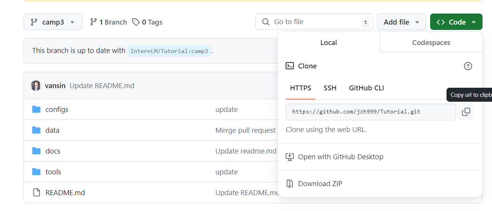

## 常见的命令

```
git add 添加文件

git commit 提交文件

git branch 分支

git checkout 切换分支

git merge 合并分支

git clone 克隆仓库

git push 推送代码

git pull 拉取代码

git status 查看状态

git log 查看日志

git reset 回滚代码

git revert 回滚代码

git diff 查看差异

git tag 标签

git remote 远程仓库

git rebase 变基

git stash 暂存
```


## 任务1: 破冰活动-自我介绍

自我介绍


git clone 仓库



修改自我介绍文件并提交


提交PR


## 实践项目：构建个人项目

创建了仓库，命名为InternLM_Phase3用来进行提交作业。

