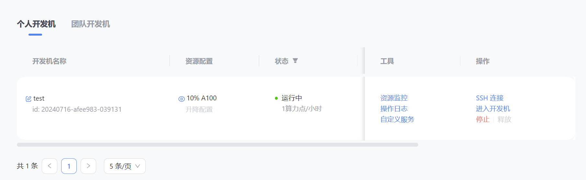

## 1、【闯关任务】完成SSH连接与端口映射并运行hello_world.py

选取10%A100服务器，创建名称和相关的基础镜像环境


添加公钥与 InternStudio 中的开发机建立SSH安全连接


vscode连接成功后, 使用nvidia-smi命令查看GPU情况。


编写展示页面的hello_world.py文件, 安装gradio库。


运行hello_world.py文件, 在本地浏览器中输入[http://localhost:7860进行展示。](http://localhost:7860进行展示。/)


## 2、【可选任务 1】将Linux基础命令在开发机上完成一遍

Linux相关指令


显卡情况


## 3、【可选任务 2】使用 VSCODE 远程连接开发机并创建一个conda环境

vscode已配置好

查看conda信息和配置镜像


创建conda环境

```
conda create -n name python=3.10
```

查看有哪些虚拟环境

```bash
conda env list
```

conda环境操作

```
#激活与退出虚拟环境
conda activate
conda deactivate
#获得环境中的所有配置
conda env export --name myenv > myenv.yml
#重新还原环境
conda env create -f  myenv.yml
```

## 4、【可选任务 3】创建并运行test.sh文件


